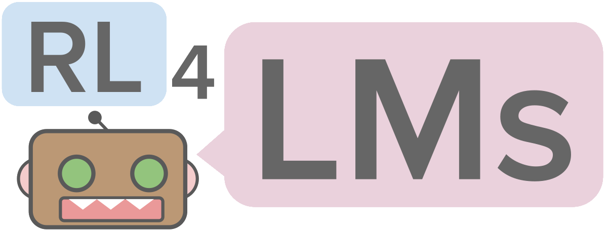

.. RL4LMs documentation master file, created by
   sphinx-quickstart on Thu Apr 20 15:20:57 2023.
   You can adapt this file completely to your liking, but it should at least
   contain the root `toctree` directive.

Welcome to RL4LMs's documentation!
==================================

.. toctree::
   :maxdepth: 2
   :caption: Contents:

RL4LMs provides easily customizable building blocks for training language models, including implementations of **on-policy algorithms**, **reward functions**, **metrics**, **datasets** and **LM based actor-critic policies**

Github Repository: https://github.com/allenai/RL4LMs

Paper Link: https://arxiv.org/abs/2210.01241

Website Link: https://rl4lms.apps.allenai.org/

Thoroughly **tested** and **benchmarked** with over **2000 experiments** :fire: (GRUE benchmark :trophy:) on a comprehensive set of: 

- 7 different Natural Language Processing (NLP) Tasks:
    - Summarization
    - Generative Commonsense Reasoning
    - IMDB Sentiment-based Text Continuation
    - Table-to-text generation
    - Abstractive Question Answering
    - Machine Translation
    - Dialogue Generation
- Different types of NLG metrics (20+) which can be used as reward functions:
    - Lexical Metrics (eg: ROUGE, BLEU, SacreBLEU, METEOR)
    - Semantic Metrics (eg: BERTSCORE, BLEURT)
    - Task specific metrics (eg: PARENT, CIDER, SPICE)
    - Scores from pre-trained classifiers (eg: Sentiment scores)
- On-policy algorithms of PPO, A2C, TRPO and novel **NLPO (Natural Language Policy Optimization)**
- Actor-Critic Policies supporting causal LMs (eg. GPT-2/3) and seq2seq LMs (eg. T5, BART)

All of these building blocks can be customizable allowing users to train transformer-based LMs to optimize any arbitrary reward function on any dataset of their choice.

Indices and tables
==================

* :ref:`genindex`
* :ref:`modindex`
* :ref:`search`
